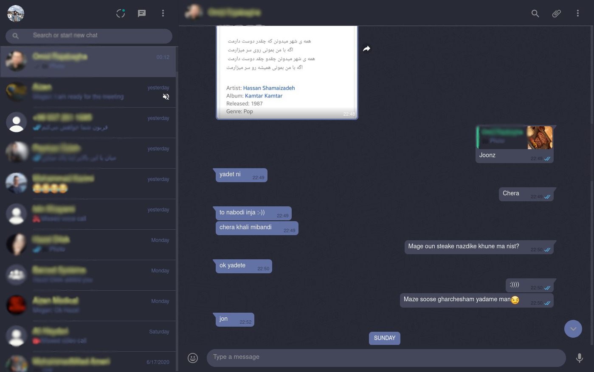

   
  
  
  
  

## Preview

## Installation
A userstyle extension is required, common ones include:

🎨 Stylus for [Firefox](https://addons.mozilla.org/en-US/firefox/addon/styl-us/), [Chrome](https://chrome.google.com/webstore/detail/stylus/clngdbkpkpeebahjckkjfobafhncgmne) or [Opera](https://addons.opera.com/en-gb/extensions/details/stylus/). 
🎨 xStyle for [Firefox](https://addons.mozilla.org/firefox/addon/xstyle/) or [Chrome](https://chrome.google.com/webstore/detail/xstyle/hncgkmhphmncjohllpoleelnibpmccpj).

Then:

📦 [Install the usercss](https://github.com/0xc0d3d00d/whatsup-dracula/raw/master/quora-dark.user.css). It supports automatic updates. 

## Contributions

If you would like to contribute to this repository, please...

1. 👓 Read the [contribution guidelines](CONTRIBUTING.md).
2.  [fork](https://github.com/0xc0d3d00d/whatsup-dracula/fork) or 
[Download](https://github.com/0xc0d3d00d/whatsup-dracula/archive/master.zip),
3. 👌 Create a pull request!

Thanks to all that have [contributed](AUTHORS) so far!
And special thanks to [Stylish Themes](https://github.com/StylishThemes) for writing good toolkit to distribute themes.
